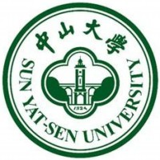

# 个人简历
---

## 基本信息

<table>
<tr>
<td>姓名</td>
<td>何亚东</td>
</tr>
<tr>
<td></td>
<td>15800010611</td>
</tr>
<tr>
<td></td>
<td>nuxseme@gmail.com</td>
</tr>
<tr><td></td>
<td>中山大学软件工程</td></tr>
</table>

* Creative		　　　　&nbsp;&nbsp;创造    万物之源
* Perfect		　　　　&nbsp;&nbsp;&nbsp;&nbsp;完美　　尽善尽美
* Accommodate	　　容纳　　有容乃大
* Explore		　　　　　探索　　星辰大海

## 格志之至
* 技术
* 极致
* 简约
* 服务

[详细](http://resume.nuxseme.com)

