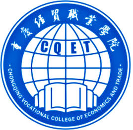

# 个人简历
***

## 基本信息
<table>
<tr>
<td>姓名</td>
<td>孙宇婷</td>
</tr>
<tr>
<td>出生年月</td>
<td>1994.10.26</td>
</tr>
<tr>
<td></td>
<td>18290248549</td>
</tr>
<tr><td></td>
<td>重庆经贸职业学院</td></tr>
</table>

## 工作经历
### 重庆中膳有饭有菜餐饮管理有限公司（中膳团餐产业集团)
- 职位:财会
- 任职时间:2016年8月—至今

#### 项目经验  
1.  独立完成公司全盘账务处理，包括进销存，税务申报，编制月季度财务报表  
2.  统计分店营业收入，审核分店每日营业报表，月末分摊经营费用与固资折旧  
3.  制定报销制度，审核所有报销单据，管控费用支出  
4.  开业预算编制，年度经营预算，与各分店核实并签订经营预算，组织分店文员学习  
5.  每周制定资金计划，按计划填写付款单支付货款，月末资金筹划，员工工资发放；统计往来账款，第一时间联系甲方催收账款  
6.  月末参与分店库房盘点，核对分店库房传回数据与公司账上数据是否相符，保证账实相符

---

### 深圳手宝广告传媒有限公司重庆分公司
  

- 职位：财会
- 任职时间：2015年11月—2016年6月

#### 项目经验 
1. 申请票据，购买发票，协助办理税务报表的申报
2. 现金及银行收付处理，制作记帐凭证，银行对帐，单据审核与保管发票，银行开户与核销
3. 登记账簿，协助编制财务报表
4. 负责与银行、税务等部门的对外联络
5. 协助主管完成其他日常事务性工作

##  荣誉证书
2014年荣获“会计从业资格证书”  
2014年荣获“计算机一级证书”  
2014年荣获“英语三级证书”  
2014年荣获普通话“三级甲等”  
2015年荣获校入党积极分子培训结业证书  
2015年荣获NCAE证书  
2015年荣获“助理会计师资格证书”  
2014-2015年荣获学院“一等奖学金”  
2015-2016年荣获“国家励志奖学金”  
2015年七月入党积极分子培训“优秀学员”  
2013年“优先团干”  
2014年校运动会“优秀个人”  

## 致谢
感谢您花时间阅读我的简历

